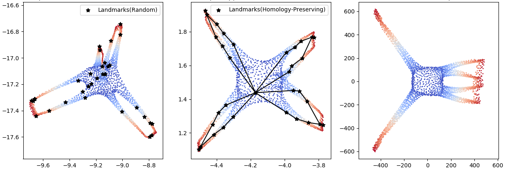
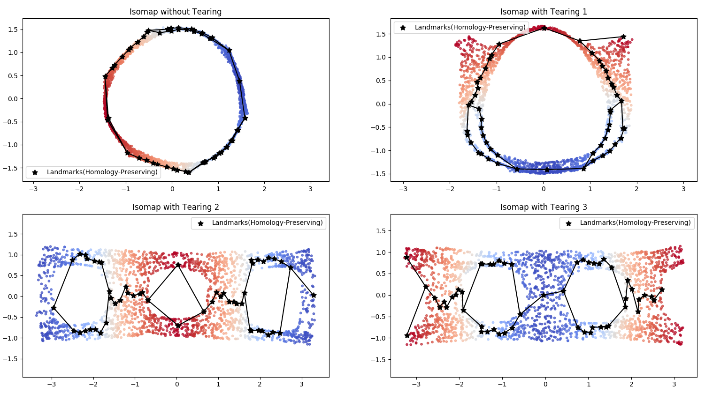

# HomologyDR_Tearing

This is a demo for implementation of homology-preserving dimension reduction(DR) algorithm. The implementation is described in "Homology-Preserving Dimensionality Reduction via Manifold Landmarking and Tearing".

# How to use

Tested with both Python 2.7 and Ubuntu 16.04.

    $ virtualenv HomologyDR-demo-env
    $ source HomologyDR-demo-env/bin/activate
    (HomologyDR-demo-env) $ pip install -r requirements.txt
    (HomologyDR-demo-env) $ cd scripts
    (HomologyDR-demo-env) $ python LandmarkingDR_Realword_dataset.py
    (HomologyDR-demo-env) $ python LandmarkingDR_synthetic_dataset.py
    (HomologyDR-demo-env) $ python Tearing.py

You can see:
- results of DR with datasets: Swiss-roll-with-a-hole and Fishing-Net in "LandmarkingDR_synthetic_dataset.py"
- results of DR with datasets: Octa and Airfoil1 in "LandmarkingDR_Realword_dataset.py"
- results of Tearing with datasets: Cylinder-3 and Cylinder-5 in "Tearing.py"

